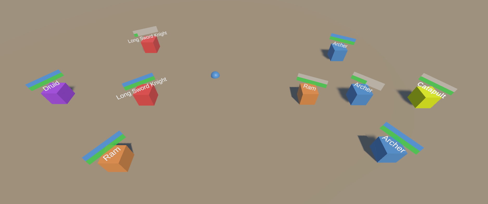

# Demonstration game project

## Part 1 (Scene Game Part 1)

I created Unit Scriptable Object so designers can define every unit class attribute easily (all the scriptable objects are in Assets/Scriptable Objects/).
I created UnitAttribute to define what types of units have what amount of damage on particular units (of course when not defined, the damage is default).
Every Unit class inherits from the "LongRangeUnit" class that shoots when attacks or the "MeleeUnit" that engages in close-quarters combat. These two classes
also inherit from the main UnitPresenter class that contains most of the important fields and mechanics.

**BattleManager** contains a **state machine** with four states: "Start", "FirstTeamTurn", "SecondTeamTurn" and "Finish" and they are executed when certain events
are called (for instance, when counting on start stops or when a unit stops attacking). TeamController is in charge of managing the units.

## Part 2 (Scene Game Part 2)

Simple inventory menagement. I created scriptable objects for every item. Used inheritance for consumables. I named "EatableItem" items that give money when used and "ItemGivingItem" items that give specific items when used (at least, it is what I understood I must do). I also created ItemContainer for all 
items in the game so the spawner can draw items from it.

## Features

- **FSM Pattern**,
- **Object Pooling Pattern**,
- **Inheritance**,
- **Interfaces**,
- **Config files (Scriptable Objects)**.

## Additional Resources
[Odin Inspector](https://odininspector.com/)

[DOTween](https://dotween.demigiant.com/)

